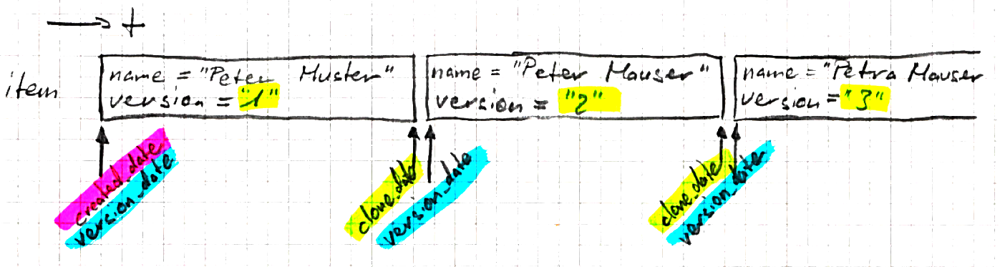

*********************************
Historization with CleanerVersion
*********************************

Disclaimer: This documentation as well as the CleanerVersion application code have been written to work against Django
1.6.x and 1.7.x. The documentation may not be accurate anymore when using more recent versions of Django.

.. _cleanerversion-quick-starter:

Quick Start
===========

Installation
------------

If you don't like to work with the sources directly, you can also install the `CleanerVersion package from PyPI
<https://pypi.python.org/pypi/CleanerVersion>`_ by doing so (you may need superuser privileges, as for every other
pip-installation)::

    pip install cleanerversion

If you want to check whether your components are compatible with CleanerVersion, you can run the unit tests coming
with CleanerVersion. To do so, register the CleanerVersion test app to the ``INSTALLED_APPS`` variable
of your Django project by adding the ``versions_tests`` keyword as follows::

    INSTALLED_APPS = (
        ...
        'versions_tests',
        ...
    )

Now, whether things work out correctly, run CleanerVersion's unit tests from within your Django
project root::

    python manage.py test versions_tests

If this terminates with a ``OK``, you're all set. Go on and create your models as follows.
Keep in mind that you are not required to keep ``versions_tests`` in your ``INSTALLED_APPS`` settings, it will only
create unnecessary tables everytime you sync with your DB. So, you can safely remove it after having run the test suite.

A simple versionable model
--------------------------

First, import all the necessary modules. In this example, all the imports are done in the beginning, such that this
would be a working example, if place in the same source file. Here's how::

    from datetime import datetime
    from django.db.models.fields import CharField
    from django.utils.timezone import utc
    from versions.models import Versionable

    class Person(Versionable):
        name = CharField(max_length=200)
        address = CharField(max_length=200)
        phone = CharField(max_length=200)

Assuming you know how to deal with `Django Models <https://docs.djangoproject.com/en/stable/topics/db/models/>`_ (you will need to sync your DB before your
code gets usable; Or you're only testing, then that step is done by Django), the next step is using your model to create
some entries::

    p = Person.objects.create(name='Donald Fauntleroy Duck', address='Duckburg', phone='123456')
    t1 = datetime.utcnow().replace(tzinfo=utc)

    p = p.clone() # Important! Fetch the returned object, it's the current one! Continue work with this one.
    p.address = 'Entenhausen'
    p.save()
    t2 = datetime.utcnow().replace(tzinfo=utc)

    p = p.clone()
    p.phone = '987654'
    p.save()
    t3 = datetime.utcnow().replace(tzinfo=utc)

Now, let's query the entries::

    donald_current = Person.objects.as_of().get(name__startswith='Donald')  # Get the current entry
    print str(donald_current.address)  # Prints 'Entenhausen'
    print str(donald_current.phone)  # Prints '987654'

    donald_t1 = Person.objects.as_of(t1).get(name__startswith='Donald')  # Get a historic entry
    print str(donald_t1.address)  # Prints 'Duckburg'
    print str(donald_t1.phone)  # Prints '123456'

A related versionable model
---------------------------

Here comes the less simple approach. What we are going to set up is both, a Many-to-One- and a
Many-to-Many-relationship. Keep in mind, that this is just an example and we try to focus on the
relationship part, rather than the semantical correctness of the entries' fields::

    from datetime import datetime
    from django.db.models.fields import CharField
    from django.utils.timezone import utc
    from versions.models import Versionable, VersionedManyToManyField, VersionedForeignKey

    class Discipline(Versionable):
        """A sports discipline"""
        name = CharField(max_length=200)
        rules = CharField(max_length=200)

    class SportsClub(Versionable):
        """Sort of an association for practicing sports"""
        name = CharField(max_length=200)
        practice_periodicity = CharField(max_length=200)
        discipline = VersionedForeignKey('Discipline')

    class Person(Versionable):
        name = CharField(max_length=200)
        phone = CharField(max_length=200)
        sportsclubs = VersionedManyToManyField('SportsClub', related_name='members')

Here comes the data loading for demo::

    running = Discipline.objects.create(name='Running', rules='There are none (almost)')
    icehockey = Discipline.objects.create(name='Ice Hockey', rules='There\'s a ton of them')

    stb = SportsClub.objects.create(name='STB', practice_periodicity='tuesday and thursday night', discipline=running)
    hcfg = SportsClub.objects.create(name='HCFG', practice_periodicity='monday, wednesday and friday night', discipline=icehockey)

    peter = Person.objects.create(name='Peter', phone='123456')
    mary = Person.objects.create(name='Mary', phone='987654')

    # Bringing things together
    # Peter wants to run
    peter.sportsclubs.add(stb)

    t1 = datetime.utcnow().replace(tzinfo=utc)

    # Peter later joins HCFG for ice hockey
    hcfg.members.add(peter)

    # Mary joins STB for running
    stb.members.add(mary)

    t2 = datetime.utcnow().replace(tzinfo=utc)

    # HCFG changes the paractice times
    hcfg = hcfg.clone()
    hcfg.practice_periodicity = 'monday, wednesday and thursday'
    hcfg.save()

    # Too bad, new practice times don't work out for Peter anymore, he leaves HCFG
    hcfg.members.remove(peter)
    t3 = datetime.utcnow().replace(tzinfo=utc)

Let's continue with the queries, to check, whether all that story can be reconstructed::

    ### Querying for timestamp t1
    sportsclub = SportsClub.objects.as_of(t1).get(name='HCFG')
    print "Number of " + sportsclub.name + " (" + sportsclub.discipline.name + ") members: " + str(sportsclub.members.count())
    for member in list(sportsclub.members.all()):
        print "- " + str(member.name)  # prints ""

    sportsclub = SportsClub.objects.as_of(t1).get(name='STB')
    print "Number of " + sportsclub.name + " (" + sportsclub.discipline.name + ") members: " + str(sportsclub.members.count())
    for member in list(sportsclub.members.all()):
        print "- " + str(member.name)  # prints "- Peter"

    ### Querying for timestamp t2
    sportsclub = SportsClub.objects.as_of(t2).get(name='HCFG')
    print "Number of " + sportsclub.name + " (" + sportsclub.discipline.name + ") members: " + str(sportsclub.members.count())
    for member in list(sportsclub.members.all()):
        print "- " + str(member.name)  # prints "- Peter"

    ### Querying for timestamp t3
    sportsclub = SportsClub.objects.as_of(t3).get(name='HCFG')
    print "Number of " + sportsclub.name + " (" + sportsclub.discipline.name + ") members: " + str(sportsclub.members.count())
    for member in list(sportsclub.members.all()):
        print "- " + str(member.name)  # prints ""

    sportsclub = SportsClub.objects.as_of(t3).get(name='STB')
    print "Number of " + sportsclub.name + " (" + sportsclub.discipline.name + ") members: " + str(sportsclub.members.count())
    for member in list(sportsclub.members.all()):
        print "- " + str(member.name)  # prints "- Peter\n- Mary"

Pretty easy, isn't it? ;)

Slowly Changing Dimensions - Type 2
===================================

Find the basics of `slowly changing dimensions - type 2`_ and other types at Wikipedia. These concepts were taken
over and extended to cover different types of relationships.

The technical details and assumptions are documented in the following sections.

.. _`slowly changing dimensions - type 2`: http://en.wikipedia.org/wiki/Slowly_changing_dimension#Type_2
__ `slowly changing dimensions - type 2`_

Historization of a single entity
================================

The definition of :class:`~versions.models.Versionable` fields is as follows:

id
    The virtual ID of an entry. This field figures also as the primary key (pk) and is randomly created

identity
    Identifies an object over all its versions, i.e. identity does not change from one version to another

version_birth_date
    The timestamp at which an object was created. All versions of an object will have the same creation date.

version_start_date
    The timestamp at which a version was created.

version_end_date
    The timestamp at which a version was cloned. If a version has not been cloned yet, ``version_end_date`` will be
    set to ``None`` (or NULL) and the entry is considered the most recent entry of an object (i.e. it is the object's
    current version)

Let's assume the following class definition for this hands-on::

    class Item(Versionable):
        name = CharField(max_length="200")  # referred to as the payload data
        version = CharField(max_length="200")  # part of the payload data as well; added for more transparency

Having the class, let's create an instance of it::

    item = Item.objects.create(name="Peter Muster", version="1")

This sequence of commands generated the following DB entry in the table associated to ``Item`` (inheriting from
:class:`~versions.models.Versionable`):

+----------+----------+---------------------+---------------------+------------------+--------------+---------+
| id (pk)  | identity | version_birth_date  | version_start_date  | version_end_date | name         | version |
+==========+==========+=====================+=====================+==================+==============+=========+
| 123      | 123      | 2014-08-14 14:43:00 | 2014-08-14 14:43:00 | None             | Peter Muster | 1       |
+----------+----------+---------------------+---------------------+------------------+--------------+---------+

Once you wish to change some value on your object, do it as follows::

    item = item.clone()
    item.name = "Peter Mauser"
    item.version = "2"
    item.save()

In the first line, we create the new version of the item entry and assign it immediately to the same variable we used
to work with.

On the new version, we can now change the payload data at will and ``save()`` the object, once we're done.

On a DB level, things will look as follows:

+----------+----------+---------------------+---------------------+---------------------+--------------+---------+
| id (pk)  | identity | version_birth_date  | version_start_date  | version_end_date    | name         | version |
+==========+==========+=====================+=====================+=====================+==============+=========+
| 123      | 123      | 2014-08-14 14:43:00 | 2014-08-14 15:09:00 | None                | Peter Mauser | 2       |
+----------+----------+---------------------+---------------------+---------------------+--------------+---------+
| 124      | 123      | 2014-08-14 14:43:00 | 2014-08-14 14:43:00 | 2014-08-14 15:09:00 | Peter Muster | 1       |
+----------+----------+---------------------+---------------------+---------------------+--------------+---------+

Notice the primary key of the current entry did not change. The original ``id`` will always point the current version of
an object.

Revisions of an object (i.e. historic versions) are copies of the current entry at the time pointed by the version's
``version_end_date``.

For making things clearer, we create another version::

    item = item.clone()
    item.name = "Petra Mauser"
    item.version = "3"
    item.save()

Once again, the situation on DB level will present itself as follows:

+----------+----------+---------------------+---------------------+---------------------+--------------+---------+
| id (pk)  | identity | version_birth_date  | version_start_date  | version_end_date    | name         | version |
+==========+==========+=====================+=====================+=====================+==============+=========+
| 123      | 123      | 2014-08-14 14:43:00 | 2014-08-14 15:21:00 | None                | Petra Mauser | 3       |
+----------+----------+---------------------+---------------------+---------------------+--------------+---------+
| 124      | 123      | 2014-08-14 14:43:00 | 2014-08-14 14:43:00 | 2014-08-14 15:09:00 | Peter Muster | 1       |
+----------+----------+---------------------+---------------------+---------------------+--------------+---------+
| 125      | 123      | 2014-08-14 14:43:00 | 2014-08-14 15:09:00 | 2014-08-14 15:21:00 | Peter Mauser | 2       |
+----------+----------+---------------------+---------------------+---------------------+--------------+---------+

On a timeline, the state can be represented as follows:

.. _cleanerversion_example_single_entry_image:

Many-to-One relationships
=========================

Declaring versioned M2O relationship
------------------------------------

Here's an example with a sportsclub that can practice at most one sporty discipline::

    class SportsClub(Versionable):
        """Sort of an association for practicing sports"""
        name = CharField(max_length=200)
        practice_periodicity = CharField(max_length=200)
        discipline = VersionedForeignKey('Discipline')

    class Discipline(Versionable):
        """A sports discipline"""
        name = CharField(max_length=200)
        rules = CharField(max_length=200)

If a M2O relationship can also be unset, don't forget to set the nullable flag (null=true) as an argument of the
``VersionedForeignKey`` field.

Adding objects to a versioned M2O relationship
----------------------------------------------

Let's create two disciplines and some sportsclubs practicing these disciplines::

    running = Discipline.objects.create(name='Running', rules='There are none (almost)')
    icehockey = Discipline.objects.create(name='Ice Hockey', rules='There\'s a ton of them')

    stb = SportsClub.objects.create(name='STB', practice_periodicity='tuesday and thursday night',
                                                discipline=running)
    hcfg = SportsClub.objects.create(name='HCFG',
                                                 practice_periodicity='monday, wednesday and friday night',
                                                 discipline=icehockey)
    lca = SportsClub.objects.create(name='LCA', practice_periodicity='individual',
                                                discipline=running)

Reading objects from a M2O relationship
---------------------------------------

Assume, timestamps have been created as follows::
    timestamp = datetime.datetime.utcnow().replace(tzinfo=utc)

Now, let's read some stuff previously loaded::

    sportsclubs = SportsClub.objects.as_of(t1)  # This returns all SportsClubs existing at time t1 [returned within a QuerySet]

You can also use select_related() to reduce the number of database queries made, if you know that you'll need the
ForeignKey-related objects::

    # Only one database query is made for this set of statements:
    hcfg = SportsClub.objects.current.select_related('discipline').get(name='HCFG')
    print hcfg.discipline.name

Note that select_related only works for models containing foreign keys.  It does not work for reverse relationships::

    # This does not save any database queries!  select_related() has no effect here:
    icehockey = Discipline.objects.current.select_related('sportsclub_set').get(name='Ice Hockey')
    print icehockey.sportsclub_set.first().name

This is not a CleanerVersion limitation; it's just the way that Django's select_related() works.  Use
prefetch_related() instead if you want to prefetch reverse or many-to-many relationships.  Note that
prefetch_related() will use at least two queries to prefetch the related objects.

Many-to-Many relationships
==========================

Declaring versioned M2M relationships
-------------------------------------

Assume a Person can be part of multiple SportsClubs::

    class Person(Versionable):
        name = CharField(max_length=200)
        phone = CharField(max_length=200)
        sportsclubs = VersionedManyToManyField('SportsClub', related_name='members')

    class SportsClub(Versionable):
        """Sort of an association for practicing sports"""
        name = CharField(max_length=200)
        practice_periodicity = CharField(max_length=200)

Adding objects to a versioned M2M relationship
----------------------------------------------
Adding objects to a many-to-many relationship works just like in standard Django::

    person1 = Person.objects.create(name="Hanover Fiste", phone="555-1234")
    person2 = Person.objects.create(name="Gloria", phone="555-6777")
    club = SportsClub.objects.create(name="Sweatshop", practice_periodicity="daily")

    # This is one way to do it:
    club.members.add(person1, person2)

    # Another way to do it to assign a list.  This will remove any existing
    # members that are not in the list, and add any members that are in the
    # list, but not yet associated in the database.
    club.members = [person1, person2]

Changing many-to-many relationships is only allowed when using the current version of the object::

    # This would raise an Exception:
    old_club = SportsClub.objects.previous_version(club)
    old_club.members.add(person3)

Reading objects from a versioned M2M relationship
-------------------------------------------------
This works just like in standard Django, with the exception that you specify either that you are using
the current state, or the state at a specific point in time::

    # Working with the current state:
    club = Club.objects.current.get(name='Sweatshop')
    local_members = club.members.filter(phone__startswith='555').all()

    # Working with a specific point in time:
    november1 = datetime.datetime(2014, 11, 1).replace(tzinfo=pytz.utc)
    club = Club.objects.as_of(november1).get(name='Sweatshop')
    # The related objects that are retrieved were existing and related as of november1, too.
    local_members = club.members.filter(phone__startswith='555').all()

    # Queries can of course traverse relationships, too:
    clubs_with_g_members = Club.objects.current.filter(members__name__startswith='G').all()

Versioning objects being part of a versioned M2M relationship
-------------------------------------------------------------
Versioning an object in a ManyToMany relationship requires 3 steps to be done, including the initial setup:

1) Setting up the situation requires to add at least two objects to a M2M relationship::

    blog1.items.add(item1)

  .. image:: ../images/clone_m2m_item_1.png
        :align: center

2) Further on, let's clone the Item-instance::

      new_item1 = item1.clone()

  .. image:: ../images/clone_m2m_item_2.png
        :align: center
3) CleanerVersion takes care of cloning and re-linking also the relationships::

    # done automatically by cleanerversion when item1.clone() was called

  .. image:: ../images/clone_m2m_item_3.png
        :align: center

Removing objects from a versioned M2M relationship
--------------------------------------------------
Changing many-to-many relationships is only allowed when using the current version of the object.

Deleting an object from a many-to-many relationship results in the record in the relationship table being
soft-deleted.  In other words, a ``version_end_date`` is set on the relationship record.

The syntax for soft-deleting is the same as the standard Django Model deletion syntax::

    # Various ways to remove one or more associations:
    club.members.remove(person1)
    club.members.remove(person2, person3)
    club.members.remove(person4.id)
    club.members = []

Navigating between different versions of an object
==================================================

Accessing the version at a given point in time
----------------------------------------------
If you have an object item1, and know that it existed at some other time t1, you can get the other version like this::

    # Will throw exception if no object exists:
    version = Item.objects.as_of(t1).get(identity=item1.identity)

    # Or like this, which will return None if no object exists:
    version = Item.objects.as_of(t1).filter(identity=item1.identity).first()

Accessing the current version of an object
------------------------------------------
``current_version(obj)`` will return the latest version of the obj, or ``None`` if no version is currently active.

Note that if the current object thinks that it is the current object (e.g. ``version_end_date`` is ``None``),
this does not check the database. This means that if you fetched a copy of obj, and some other code has
created a new version of obj before you call ``current_version()``, you will get your existing obj returned,
not the newest version from the database.
::

    current_version = Items.objects.current_version(item1)

Accessing the previous and next versions of an object
-----------------------------------------------------
You can navigate between the versions of an object that you have.

``previous_version(obj)`` will provide the previous version of obj.  If there is no previous version, the returned
object will be the same object.
::

    previous = Items.objects.previous_version(item1)

``next_version(obj)`` will provide the next version of obj.  If there is no next version, the returned
object will be the same object.

Note that if the current object's ``version_end_date`` is ``None``, this does not check the database.  This means that
if you fetched a copy of obj, and some other code has created a new version of obj before you call ``next_version()``,
you will get your existing obj returned, not the newest version from the database.
::

    next = Items.objects.next_version(item1)

``current_version``, ``previous_version`` and ``next_vesion`` accept an optional parameter ``relations_as_of``.
This allows you to control the point in time which is used for accessing related objects (e.g. related by foreign key,
reverse foreign key, one-to-one or many-to-many fields).  Valid values for ``relations_as_of`` are:

- ``'end'``: use version_end_date minus one microsecond.  If the version is current, current related objects are
  returned when accessing relation fields.  This is the default.

- ``'start'``: use version_start_date

- ``datetime object``: use this datetime.  If the supplied datetime lies outside of the validity range of the version,
  a ``ValueError`` will be raised.

- ``None``: no restriction is done.  All objects ever associated with this object will be returned when accessing
  relation fields.

Unique Indexes
==============
To have unique indexes with versioned models takes a bit of care. The issue here is that multiple versions having the same
data can exist; potentially the only difference will be with the ``id``, ``version_start_date``, and ``version_end_date``
columns.

For example, what if we want the name and phone_number to be unique together for current versions:

+----------+----------+---------------------+---------------------+---------------------+--------------+--------------+
| id (pk)  | identity | version_birth_date  | version_start_date  | version_end_date    | name         | phone_number |
+==========+==========+=====================+=====================+=====================+==============+==============+
| 123      | 123      | 2014-08-14 14:43:00 | 2014-08-14 15:21:00 | None                | Petra Mauser | 555-1234     |
+----------+----------+---------------------+---------------------+---------------------+--------------+--------------+
| 124      | 123      | 2014-08-14 14:43:00 | 2014-08-14 14:43:00 | 2014-08-14 15:09:00 | Peter Muster | 555-1234     |
+----------+----------+---------------------+---------------------+---------------------+--------------+--------------+

In Postgresql, it's possible to create a
`partially unique index <http://www.postgresql.org/docs/9.3/static/indexes-partial.html#INDEXES-PARTIAL-EX3>`_ which
enforces that name and phone_number are unique together when the version_end_date is null.  Other databases may have
a similar capability.  A helper method for creating these partially unique indexes is provided for Postgresql, see
the `Postgresql specific`_ section for more detail.

Postgresql specific
===================
Django creates `extra indexes <https://docs.djangoproject.com/en/1.7/ref/databases/#indexes-for-varchar-and-text-columns>`_
for CharFields that are used for like queries (e.g. WHERE foo like 'fish%'). Since Django 1.6 and 1.7 do not support
native database UUID fields, the UUID fields that are used for the id and identity columns of Versionable models have these extra
indexes created.  In fact, these fields will never be compared using the like operator.  Leaving these indexes would create a
performance penalty for inserts and updates, especially for larger tables.  ``versions.util.postgresql`` has a function
``remove_uuid_id_like_indexes`` that can be used to remove these extra indexes.

For the issue of `Unique Indexes`_, ``versions.util.postgresql`` has a function ``create_current_version_unique_indexes`` that can
be used to create unique indexes.  For this to work, it's necessary to define a VERSION_UNIQUE attribute when defining the model::

    class Person(Versionable):
        name = models.CharField(max_length=40)
        phone_number = models.CharField(max_length=20)

        VERSION_UNIQUE = [['name', 'phone_number']]

If there are multiple sets of columns that should be unique, use something like this::

    VERSION_UNIQUE = [['field1', 'field2'], ['field3', 'field4']]

For an example of how to transparently create the database indexes for these VERSION_UNIQUE definitions in a Django app, as well
as removing the extra like indexes created on the CharField columns, see:

* https://github.com/swisscom/cleanerversion/blob/master/versions_tests/__init__.py
* https://github.com/swisscom/cleanerversion/blob/master/versions_tests/apps.py

Note that this example is for Django >= 1.7; it makes use of the
`application registry <https://docs.djangoproject.com/en/stable/ref/applications/>`_ that was introduced in Django 1.7.

For Django 1.6, it is possible to do something similar.  The functions in ``versions.util.postgresql`` should be able to be used
unchanged for Django 1.6.

Integrating CleanerVersion versioned models with non-versioned models
=====================================================================

It is possible to combine both, versioned models (as described up to this point) and non-versioned models.

In order to have your relationships work out correctly, make use of ``VersionedForeignKey`` as described in the
following table.
For example, one has to read the table as follows: \
"If a model inheriting directly from Django's ``Model`` is pointing
a model inheriting from ``Versionable``, then a ``VersionedForeignKey`` relation has to be used."

+--------------------------------------+--------------+-----------------------+
| Model def. FK \\ Model pointed by FK | models.Model | Versionable           |
+======================================+==============+=======================+
| **models.Model**                     | ForeignKey() | VersionedForeignKey() |
+--------------------------------------+--------------+-----------------------+
| **Versionable**                      | ForeignKey() | VersionedForeignKey() |
+--------------------------------------+--------------+-----------------------+

Note that M2M-relationships have not been extended yet to work in a heterogeneous use case as described here.

Known Issues
============

* No `multi-table inheritance <https://docs.djangoproject.com/en/stable/topics/db/models/#multi-table-inheritance>`_ support.
  Multi-table inheritance currently does not work if the parent model has a Versionable base class.
  See `this issue <https://github.com/swisscom/cleanerversion/issues/19>`_ for more details.

* Creating `Unique Indexes`_ is a bit tricky for versioned database tables.  A solution is provided for Postgresql (see the
  `Postgresql specific`_ section).  Pull requests are welcome if you solve this problem for another database system.

* No integration with Django admin: The Django admin does not call `.clone()`. Such an integration appears to be non-trivial. For more information, see `issue #59 <https://github.com/swisscom/cleanerversion/issues/59>`_.

For a more up-to-date state please check our `project page <https://github.com/swisscom/cleanerversion>`_.
